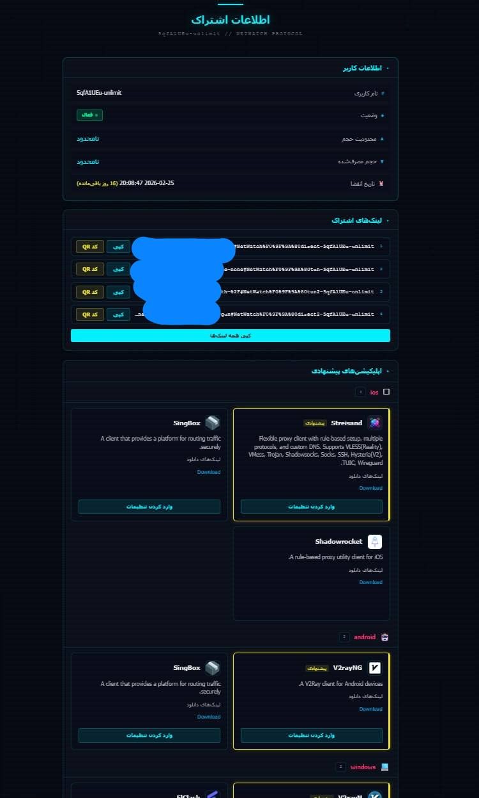

# Netwatch Subscription Template

A modern, cyberpunk-themed subscription information page for Pasarguard VPN panel with Persian/English bilingual support.

[**فارسی**](README.fa.md) | English


---

## 🌟 Features

- **Cyberpunk 2077 Inspired Design** - Neon colors, glitch effects, and futuristic UI
- **Bilingual Support** - Full Persian (RTL) and English (LTR) translation
- **Responsive Layout** - Works perfectly on desktop, tablet, and mobile
- **Interactive Elements**:
  - One-click link copying
  - QR code generation for subscription links
  - Animated data usage progress bars
  - Matrix-style data stream background
  - Glitch text effects
- **Smart Status Indicators** - Visual badges for subscription status
- **Platform-Specific App Recommendations** - Grouped by iOS, Android, Windows, macOS, Linux

---

## 📦 Installation

### Automatic Installation (Recommended)

Run this one-liner command on your Pasarguard server:

```bash
bash <(curl -fsSL https://raw.githubusercontent.com/alixtron0/pasarguard-netwatch-sub/main/install.sh)
```

**What it does:**
1. Downloads `sub.html` to `/var/lib/pasarguard/templates/`
2. Automatically configures `/opt/pasarguard/.env`
3. Restarts Pasarguard service
4. Shows success message

---

### Manual Installation

1. **Edit Pasarguard Environment:**
   ```bash
   pasarguard edit-env
   ```

2. **Find and uncomment these lines:**
   ```env
   CUSTOM_TEMPLATES_DIRECTORY=/var/lib/pasarguard/templates/
   SUBSCRIPTION_PAGE_TEMPLATE=sub.html
   ```

3. **Create templates directory:**
   ```bash
   mkdir -p /var/lib/pasarguard/templates/
   ```

4. **Download the template:**
   ```bash
   curl -o /var/lib/pasarguard/templates/sub.html \
     https://raw.githubusercontent.com/alixtron0/pasarguard-netwatch-sub/main/sub.html
   ```

5. **Restart Pasarguard:**
   ```bash
   pasarguard restart
   ```

---

## 🎨 Customization

Edit the template directly on your server:

```bash
nano /var/lib/pasarguard/templates/sub.html
```

### Available Variables

See [VARIABLES.md](VARIABLES.md) for complete documentation of all Jinja2 template variables and their usage.

**Quick reference:**
- `{{ user.username }}` - User's username
- `{{ user.status }}` - Account status (active, expired, etc.)
- `{{ user.data_limit }}` - Total data limit
- `{{ user.used_traffic }}` - Used bandwidth
- `{{ links }}` - List of subscription links
- `{{ apps }}` - Recommended applications list

---

## 🎯 Color Scheme

The template uses a carefully crafted cyberpunk color palette:

| Color | Hex | Usage |
|-------|-----|-------|
| Cyan | `#00f0ff` | Primary accent, titles, borders |
| Magenta | `#ff2d6f` | Errors, close buttons |
| Yellow | `#f0e130` | Warnings, recommendations |
| Green | `#00ff9d` | Success, active status |
| Red | `#ff3333` | Alerts, critical status |
| Purple | `#a855f7` | On-hold status |

---

## 📱 Browser Support

- ✅ Chrome/Edge 90+
- ✅ Firefox 88+
- ✅ Safari 14+
- ✅ Mobile browsers (iOS Safari, Chrome Mobile)

---

## 🤝 Contributing

Contributions are welcome! Please feel free to submit a Pull Request.

1. Fork the repository
2. Create your feature branch (`git checkout -b feature/AmazingFeature`)
3. Commit your changes (`git commit -m 'Add some AmazingFeature'`)
4. Push to the branch (`git push origin feature/AmazingFeature`)
5. Open a Pull Request

---

## 📄 License

This project is licensed under the MIT License - see the [LICENSE](LICENSE) file for details.

---

## 💬 Support

Need help? Contact support:
- 📱 Telegram: [@netwatch_vpnbot](https://t.me/netwatch_vpnbot)
- 🐛 Issues: [GitHub Issues](https://github.com/alixtron0/pasarguard-netwatch-sub/issues)

---

## 🙏 Acknowledgments

- Inspired by Cyberpunk 2077 aesthetic
- Built for [Pasarguard](https://github.com/PasarGuard/panel) VPN panel
- Uses [QRCode.js](https://github.com/davidshimjs/qrcodejs) for QR generation

---

**Made with 💙 for the Pasarguard community**

---

## 📸 Demo Screenshot


